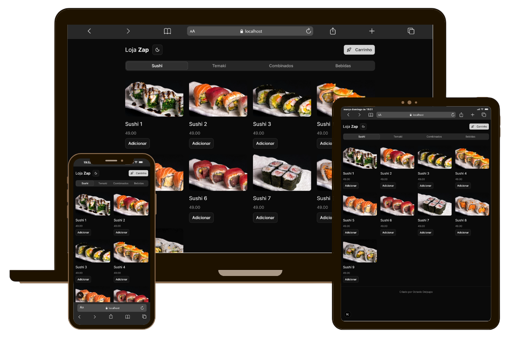

# 🍣 Loja-Zap

A **Loja-Zap** é uma aplicação web de uma loja de sushi desenvolvida com **Next.js**.
O projeto foi criado durante uma aula da **B7Web**, com o objetivo de praticar conceitos de desenvolvimento web moderno utilizando **React** e **Next.js**.

A aplicação simula uma loja online onde é possível visualizar **sushis** e **combos**, adicionar itens ao carrinho e enviar o pedido diretamente para o **WhatsApp**.

---

# 🚀 Tecnologias Utilizadas

- Next.js
- React
- JavaScript
- TypeScript

---

# 📦 Funcionalidades

- 🍣 Listagem de sushis
- 🥢 Combos promocionais
- 🛒 Carrinho de compras
- ✏️ Edição da quantidade de produtos no carrinho
- 📱 Interface simples e responsiva
- 📲 Envio do pedido diretamente para o WhatsApp
- ⚡ Estrutura moderna utilizando Next.js

---

# 🛒 Como Funciona o Carrinho

1. O usuário seleciona um **sushi ou combo**.
2. O produto é adicionado ao **carrinho de compras**.
3. Ao abrir o carrinho, é possível **editar a quantidade** de cada item.
4. Após confirmar o pedido, o sistema **gera uma mensagem automática**.
5. O pedido é enviado diretamente para o **WhatsApp**.

---

<p align="center">
  
</p>

---

# ▶️ Como Rodar o Projeto

Clone o repositório:

```bash
git clone https://github.com/OctavioDelpupo/b7web-loja-zap
```

Entre na pasta:

```bash
cd loja-zap
```

Instale as dependências:

```bash
npm install
```

Execute o projeto:

```bash
npm run dev
```

Depois abra no navegador:

```
http://localhost:3000
```

---

# 📚 Créditos

Projeto desenvolvido durante as aulas da **B7Web** para fins de estudo e prática com **Next.js**.

---

💡 Projeto educacional.

## :memo: Licença

Esse projeto está sob a licença MIT. Veja o arquivo [LICENSE](LICENSE) para mais detalhes.
